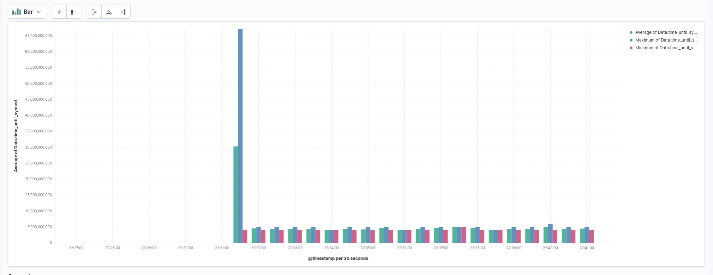
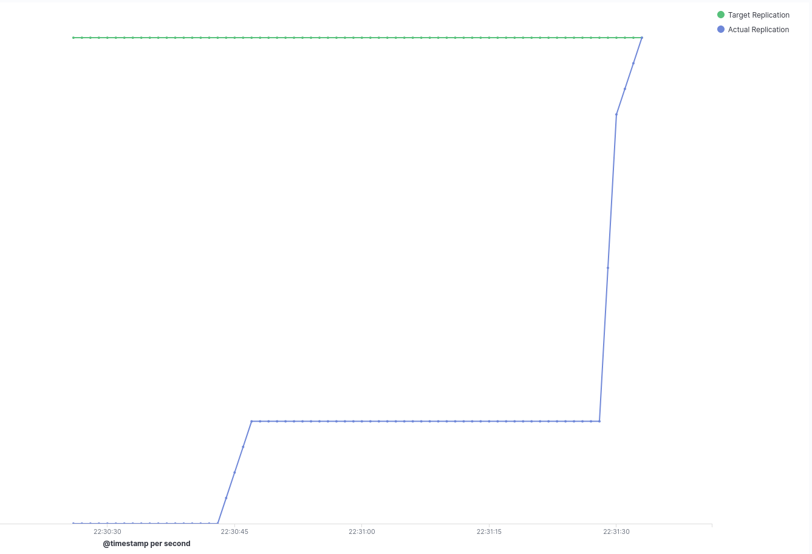
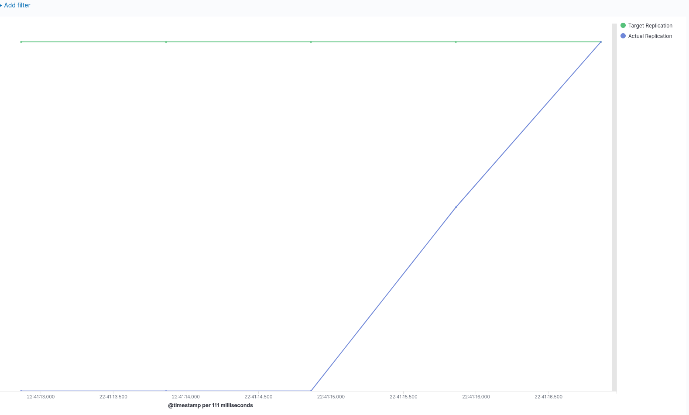

# Benchmark one

We ran 20 nodes with the following geographical distribution:

```
    - count: 2
      region: us-east-2
    - count: 3
      region: us-east-2
    - count: 3
      region: us-west-2
    - count: 3
      region: ap-south-1
    - count: 2
      region: ap-northeast-3
    - count: 3
      region: ap-northeast-2
    - count: 4
      region: eu-west-3
```

At the beginning of the run, nodes were unaware of each other, we used the standard bootstrap nodes,
nothing custom.
We then created 100 IPFS objects with a few seconds intervals, each 1MB in size, uploaded and pinned it to one instance and measured the time
it took for all others to resolve the uploaded file.

Results:




This suggests that initially it takes a long time for all nodes to find the data, as soon as they have exchanged some data,
the propagation delay drops to about 4 seconds, lets look at the first cid we published in detail:




versus the one of the last cid we published, with the nodes already aware of each other



This, from publish to completely propagated took around 4 seconds, ( note that we only record propagation count once a second )

Logs for the last element:


```
{"level":"info","msg":"cid generated: QmRawkftKmRGLDGbV4EBcNTok3Ng8n2Gwj46B4Z3PFDac8","runId":"XVlBzgba","source":"bench","starttime":"2021-04-22T22:27:09.823580645+02:00","time":"2021-04-22T22:41:12+02:00"}
{"actualCount":0,"cid":"QmRawkftKmRGLDGbV4EBcNTok3Ng8n2Gwj46B4Z3PFDac8","level":"info","msg":"Count update","runId":"XVlBzgba","source":"bench","starttime":"2021-04-22T22:27:09.823580645+02:00","targetCount":19,"time":"2021-04-22T22:41:12+02:00"}
{"actualCount":0,"cid":"QmRawkftKmRGLDGbV4EBcNTok3Ng8n2Gwj46B4Z3PFDac8","level":"info","msg":"Count update","runId":"XVlBzgba","source":"bench","starttime":"2021-04-22T22:27:09.823580645+02:00","targetCount":19,"time":"2021-04-22T22:41:13+02:00"}
{"actualCount":0,"cid":"QmRawkftKmRGLDGbV4EBcNTok3Ng8n2Gwj46B4Z3PFDac8","level":"info","msg":"Count update","runId":"XVlBzgba","source":"bench","starttime":"2021-04-22T22:27:09.823580645+02:00","targetCount":19,"time":"2021-04-22T22:41:14+02:00"}
{"actualCount":10,"cid":"QmRawkftKmRGLDGbV4EBcNTok3Ng8n2Gwj46B4Z3PFDac8","level":"info","msg":"Count update","runId":"XVlBzgba","source":"bench","starttime":"2021-04-22T22:27:09.823580645+02:00","targetCount":19,"time":"2021-04-22T22:41:15+02:00"}
{"actualCount":19,"cid":"QmRawkftKmRGLDGbV4EBcNTok3Ng8n2Gwj46B4Z3PFDac8","level":"info","msg":"Target count reached!!!","runId":"XVlBzgba","source":"bench","starttime":"2021-04-22T22:27:09.823580645+02:00","targetCount":19,"time":"2021-04-22T22:41:16+02:00"}
{"cid":"QmRawkftKmRGLDGbV4EBcNTok3Ng8n2Gwj46B4Z3PFDac8","level":"info","msg":"Count done","runId":"XVlBzgba","source":"bench","starttime":"2021-04-22T22:27:09.823580645+02:00","time":"2021-04-22T22:41:16+02:00","time_until_synced":4005329209}
``
